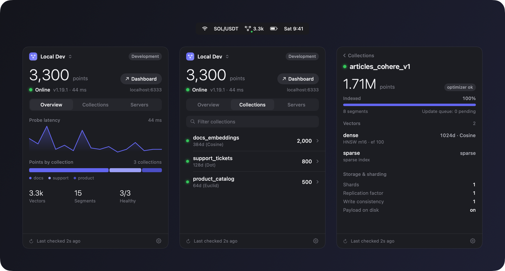

<p align="center">
  
</p>

<h1 align="center">QdrantBar</h1>

<p align="center">
  See what your Qdrant server is doing without leaving the menu bar.<br />
  A small, native, read-only macOS app for developers.
</p>

<p align="center">
  
  
  
</p>

<p align="center">
  
</p>

QdrantBar is an unofficial community tool and is not affiliated with Qdrant.

It replaces the `curl localhost:6333/collections` habit: one click shows whether the server is up, how many points it holds, and whether any collection needs attention.

## Features

**See**
- A menu bar item with a status dot and one stat of your choice: points (default), latency, collections, or just the icon. Green is online, amber is degraded or needs an API key, gray is offline.
- A popover with the total point count, server state, version and latency at the top, and three tabs: Overview, Collections and Servers.
- A latency sparkline, a bar showing how points split across collections, and vector, segment and health totals.

**Inspect**
- Click a collection for its detail screen:
  - status, optimizer state, indexing progress, segments and update queue length
  - each vector's size, distance, on-disk flag, HNSW settings and quantization, plus sparse vectors
  - shards, replication factor, write consistency and payload storage
  - payload indexes, aliases and the newest snapshots with their sizes
- A yellow collection explains itself: how many optimizations are running or queued, or the optimizer's error message.
- A small collection that reports zero indexed vectors is shown as an exact scan, not as a fault.
- Copy the collection's JSON or a ready-to-paste `curl` command, or open it in the Qdrant dashboard.

**Connect**
- Save several servers (local, staging, Qdrant Cloud) and switch between them from the header.
- API keys are stored in the macOS Keychain.
- Test connection checks the key against `/collections`, not just `/healthz`, so a rejected key is reported instead of looking healthy.
- Remote `http://` servers are refused unless you allow insecure HTTP for that one server. See [Connecting to a remote server](#connecting-to-a-remote-server).

**Stay out of the way**
- Read-only. QdrantBar sends only `GET` requests and never starts, stops or changes your server or its data.
- Refreshes on a schedule you choose, and only checks `/healthz` while the popover is closed.
- No analytics and no third-party dependencies. It talks only to the servers you add.
- Follows the system light and dark appearance.

## Install

### Build from source

Needs macOS 14+ and a Swift 6 toolchain (Xcode or the Command Line Tools).

```bash
git clone https://github.com/fr3on/qdrantbar.git
cd qdrantbar
./scripts/build-app.sh      # builds build/QdrantBar.app (universal: Apple silicon + Intel)
open build/QdrantBar.app
```

QdrantBar has no Dock icon. Look for it in the menu bar. The first launch opens a short setup that connects your first server.

To package a disk image instead, run `./scripts/make-dmg.sh`. It writes `dist/QdrantBar-<version>.dmg`.

### Opening an unsigned build

The app is ad-hoc signed, not notarized, so macOS blocks a copy that was downloaded or copied from another machine. To allow it, open **System Settings > Privacy & Security** and click **Open Anyway**, or remove the quarantine flag:

```bash
xattr -dr com.apple.quarantine /path/to/QdrantBar.app
```

A build you make yourself runs without a warning.

## Connecting to a remote server

Use `https://` when you can. macOS blocks unencrypted `http://` to remote hosts, and QdrantBar enforces the same rule itself:

- **HTTPS.** Enable TLS in Qdrant, or put Caddy or nginx in front of it.
- **SSH tunnel.** Forward the port and point QdrantBar at `http://localhost:6333`:
  ```bash
  ssh -N -L 6333:localhost:6333 user@your-server
  ```
- **Allow insecure HTTP.** For a network you trust, such as a LAN or VPN, switch on **Allow insecure HTTP for this server** when adding it. The API key and data are then sent unencrypted. A server that allows this shows an open-lock icon in the popover.

A `localhost` address never needs the switch.

## Settings

Open the gear menu in the popover and choose **Settings**. Changes save instantly.

- **Menu bar:** what to show next to the icon, with a live preview, and whether to show only the icon and dot while the server is offline.
- **Refresh:** how often the popover refreshes while open (5, 10 or 30 seconds), and how often the menu bar item checks `/healthz` in the background (30 seconds, 1 minute, 5 minutes or off).
- **General:** Launch at login, and Appearance (System, Light or Dark).
- **Servers, Privacy, About:** manage servers, show the setup again, and the version.

## What it reads

Every request is a `GET` to a server you added. Nothing else is contacted.

| Endpoint | Used for |
| :--- | :--- |
| `/healthz` | Reachability and latency |
| `/` | Server version |
| `/collections` and `/collections/{name}` | Collection list, status, vectors, config, payload indexes |
| `/collections/{name}/aliases` | Aliases |
| `/collections/{name}/snapshots` | Snapshot names, dates and sizes |
| `/collections/{name}/optimizations` | Running and queued optimizations |

The API key, when set, is sent as the `api-key` header.

## Safety and privacy

- **Read-only.** There is no button that changes state. Snapshots, aliases and optimizer runs stay in the Qdrant dashboard, one click away.
- **Encrypted or opted in.** A remote `http://` request is refused before anything, including the API key, is sent, unless that server allows it.
- **Untrusted names.** Collection names come from the server, so the copied `curl` command percent-encodes and single-quotes them and cannot inject shell commands.
- **No telemetry.** QdrantBar collects nothing and makes no network requests except to your servers.

See [SECURITY.md](SECURITY.md) to report a problem and for the App Transport Security details.

## Development

```bash
swift build          # compile
swift test           # run the tests
./scripts/build-app.sh   # package build/QdrantBar.app
./scripts/make-dmg.sh    # wrap it in dist/QdrantBar-<version>.dmg
./scripts/make-icon.sh   # redraw assets/ and AppIcon.icns
```

```
Sources/
  QdrantBarCore/   REST client, models, connection policy, settings, Keychain. No UI imports.
  QdrantBar/       SwiftUI app: menu bar item, popover, screens, design system.
Tests/             Swift Testing suites. Qdrant responses live in Fixtures/.
scripts/           build-app, make-dmg, release, make-icon
assets/            App icon and logo
```

- **Screens from the real views.** A debug build can render the app's own views with fixture data to a PNG: `.build/debug/QdrantBar --snapshot /tmp/screens.png`. It never touches the network, the Keychain or your saved servers.

Contributions are welcome. Read [CONTRIBUTING.md](CONTRIBUTING.md) first.

## License

[MIT](LICENSE)
